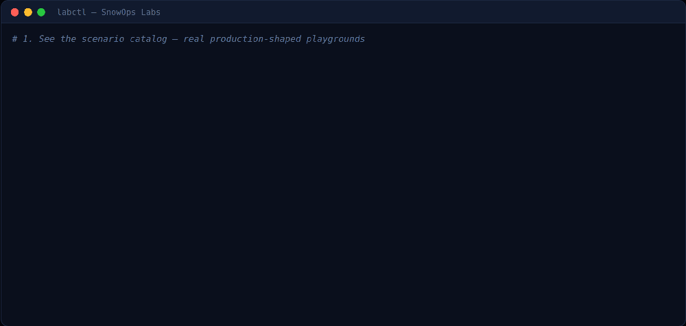
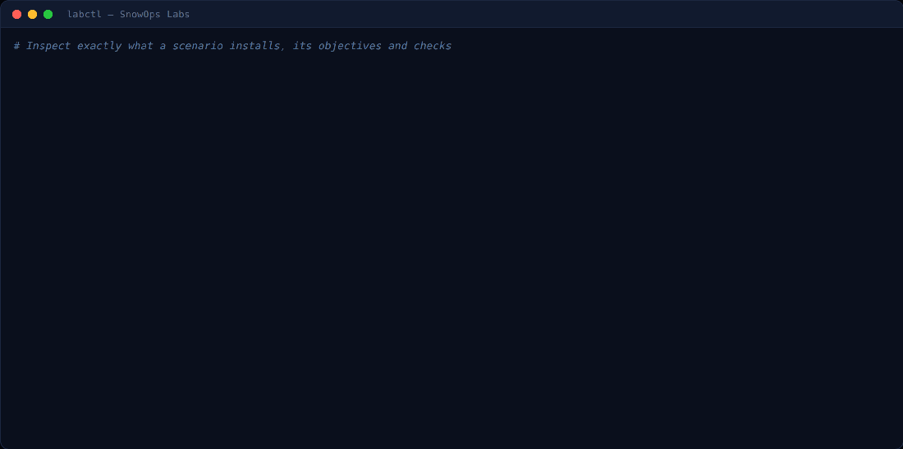
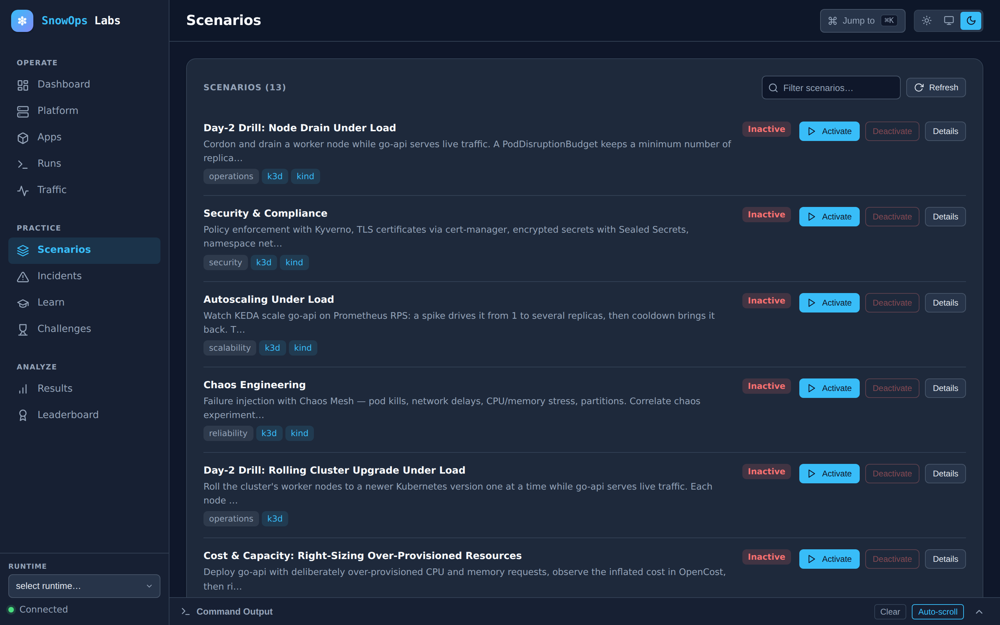
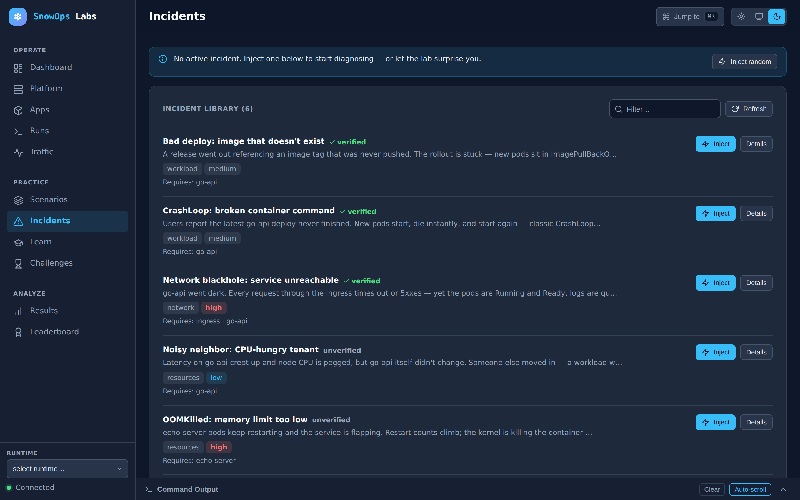
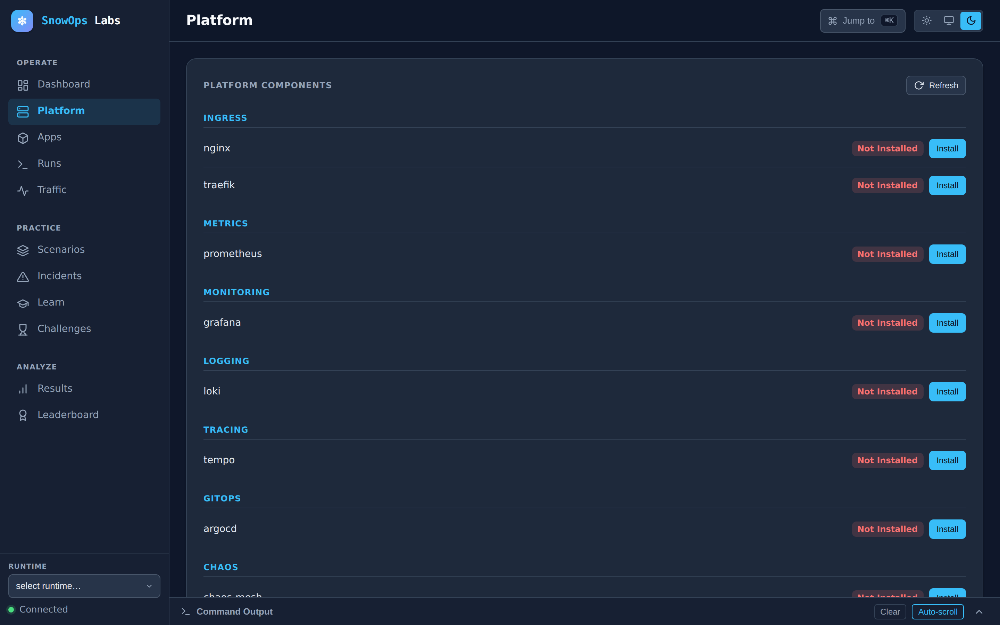
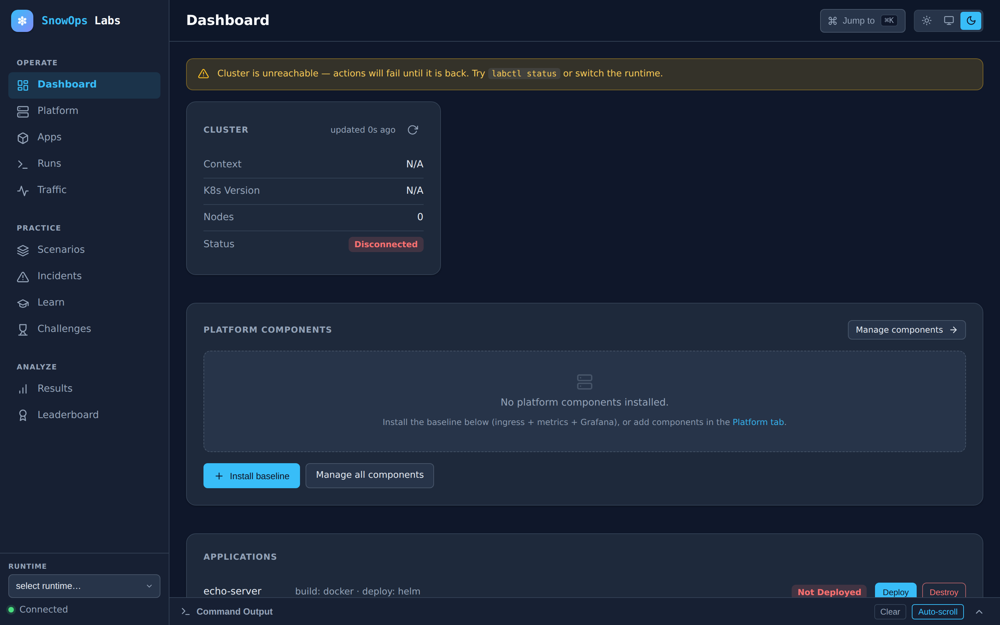

<p align="center">
  <picture>
    <source media="(prefers-color-scheme: dark)"  srcset="docs/assets/brand/logo-dark.png">
    <source media="(prefers-color-scheme: light)" srcset="docs/assets/brand/logo-light.png">
    
  </picture>
</p>

<p align="center">
  <em>Stand up a production-shaped Kubernetes cluster · break it on purpose · fix it · get graded.</em>
</p>

<p align="center">
  <a href="LICENSE"></a>
  <a href="https://github.com/sagar2395/snowopslabs/actions/workflows/ci.yaml"></a>
  <a href="https://github.com/sagar2395/snowopslabs/releases"></a>
  
  <a href="CONTRIBUTING.md"></a>
</p>

**SnowOps Labs is a Kubernetes platform-engineering simulator.** It stands up a
realistic, production-shaped cluster on your laptop in minutes, breaks it in
realistic ways, and grades you on how you fix it.

Practise the things production never lets you practise: diagnosing a
CrashLoopBackOff with a pager going off, draining a node under load without
breaking the SLO, deciding between two service meshes with evidence instead of
opinion.

> **Early release.** The core loop — stand up a cluster, run a scenario, break
> it, fix it, tear it down — works today; expect rapid iteration and the odd
> rough edge, and please [file issues](https://github.com/sagar2395/snowopslabs/issues).
> See [`docs/PRODUCT.md`](docs/PRODUCT.md) for what it is and who it is for, and
> [`docs/architecture/ARCHITECTURE.md`](docs/architecture/ARCHITECTURE.md) for
> how it works.
>
> Runs on **macOS (Apple Silicon and Intel), Linux, and Windows via WSL2**.

<p align="center">
  
</p>

## The four loops

| Loop | What you do | Command |
|---|---|---|
| **Build** | Stand up a cluster and install a real platform stack from swappable providers | `labctl init` |
| **Simulate** | Activate a declarative scenario with objectives and verifiable checks | `labctl scenario up <name>` |
| **Break** | Inject a realistic, reversible fault while traffic flows and alerts fire | `labctl incident inject <name>` |
| **Measure** | Grade the outcome — checks passed, time taken, hints used | `labctl scenario verify <name>` |

Everything you install is the real thing: actual Prometheus, actual Istio,
actual Kafka. Failures are injected into real systems, so the signal you debug
is the signal you would see in production.

## What's inside

| Layer | What it does |
|---|---|
| **Runtimes** | `k3d` (the golden path), `kind` (headless, powers CI), `incluster` (shared team server) |
| **Platform** | Ingress (Traefik/Nginx), monitoring (Prometheus + Grafana), logging (Loki), tracing (Tempo), GitOps (ArgoCD), mesh (Istio/Linkerd), data (Kafka/Postgres), secrets (Vault/ESO), autoscaling (KEDA), cost (OpenCost), security (Kyverno, cert-manager), chaos (Chaos Mesh) |
| **Scenarios** | Declarative playgrounds with objectives and machine-verifiable checks |
| **Incidents** | Reversible production faults with progressive hints and MTTR measurement |
| **Learn** | Ordered paths chaining scenarios and incidents into a curriculum |
| **Challenges** | Timed, graded runs with hidden hints |
| **Apps** | `go-api` (HTTP + metrics + tracing), `echo-server` (HTTP + Redis) |
| **CLI + UI** | `labctl` — one binary with the web dashboard embedded |

## See it in action

Every asset below is real `labctl` output and the actual embedded UI — no mockups.

**Inspect a scenario before you run it.** `labctl scenario info` shows exactly
what a scenario installs — its stages, objectives, the machine-checked
verifications that grade you, and copy-paste explore hints:

<p align="center">
  
</p>

**Drive it from a browser.** `labctl ui` serves an embedded web dashboard at
`http://localhost:3939` — no extra install — and it follows your system
light/dark theme:

<picture>
  <source media="(prefers-color-scheme: dark)"  srcset="docs/assets/ui-scenarios.png">
  <source media="(prefers-color-scheme: light)" srcset="docs/assets/ui-scenarios-light.png">
  
</picture>

More of the dashboard — click any thumbnail for full size:

| Fault library | Platform components | Operate hub |
|---|---|---|
| [](docs/assets/ui-incidents.png) | [](docs/assets/ui-platform.png) | [](docs/assets/ui-dashboard.png) |

## What you need

- **macOS, Linux, or Windows with WSL2.**
- **Docker with at least 2 CPUs and 4 GB of memory.** On macOS you don't need to
  install anything: `labctl init` installs colima (a lightweight Docker VM) with
  Homebrew and starts it at that size. Docker Desktop works too.
- **About 10 GB of free disk** for the VM, images and cluster.

Everything else — `kubectl`, `helm`, `k3d` — `labctl init` installs for you,
without sudo (Homebrew on macOS, `~/.local/bin` on Linux and WSL).

How much memory you need depends on how much you run at once:

| Docker size | What it runs |
|---|---|
| **2 CPU / 4 GB** (minimum) | The cluster, the monitoring stack and one scenario at a time, including the observability and autoscaling scenarios. |
| **4 CPU / 6 GB** | A couple of scenarios together, or the heavier ones on their own (Kafka, service mesh, GitOps). |
| **4 CPU / 8 GB** | Several scenarios at once. |

You don't have to guess: before a scenario starts, labctl checks it fits and,
if not, tells you which scenario to stop or how to give Docker more memory.
Details and per-scenario figures: [Resources](docs/resources.md).

Your OS in detail: [macOS](docs/getting-started/macos.md) ·
[Linux](docs/getting-started/linux.md) ·
[Windows (WSL2)](docs/getting-started/wsl.md).

## Install

Your lab is a clone of this repository: every manifest, Helm values file,
scenario and incident is a file you can open, read and change. Clone the latest
release anywhere you like, then run its installer:

```bash
git clone --branch stable https://github.com/sagar2395/snowopslabs.git
cd snowopslabs
./install.sh
```

`stable` always points at the latest release; to pin one, clone with
`--branch v1.5.0` instead. `install.sh` downloads the `labctl` binary that
matches your clone into `~/.local/bin`, verifies its checksum and needs no sudo.
It also records where your clone is, so `labctl` works from any directory. It
prints the line to add to your shell profile if `~/.local/bin` is not on your
`PATH` yet.

On Windows, clone inside WSL2, in your Linux home (`cd ~`), not under `/mnt/c`.

## Your first lab

```bash
labctl init
```

`init` checks your machine, installs what is missing, starts Docker at the
right size, creates a local Kubernetes cluster and installs the platform
(Traefik, Prometheus, Grafana). The first run downloads a few hundred MB and
takes about five to ten minutes; it ends with the lab's URLs. If anything is
wrong — Docker too small, a stalled download, a pod that won't start — it stops
and says how to fix it.

Open the dashboard:

```bash
labctl ui          # http://localhost:3939
```

Run a scenario. `--deploy-prereqs` builds and deploys the app it runs against
and installs any platform component it needs:

```bash
labctl scenario list
labctl scenario info observability-sre       # what it installs, its objectives and checks
labctl scenario up observability-sre --deploy-prereqs
labctl scenario verify observability-sre     # how you're doing
labctl scenario down observability-sre       # when you're done
```

Break something and fix it:

```bash
labctl incident inject crashloop-bad-config --deploy-prereqs
labctl incident status                       # hints and whether it is resolved
```

The cluster is yours: `kubectl` and `helm` work against it directly.

## Experiment with the lab

Open your clone in your editor. What a scenario installs is in
`scenarios/<name>/` (manifests, scripts, checks), each platform component's
Helm values in `platform/<category>/<provider>/values.yaml`, and each fault in
`incidents/<name>/`. `labctl scenario info <name>` lists what a scenario uses.

Work on a branch of your own, so upgrades merge cleanly and you can always get
back to the original:

```bash
git switch -c my-experiments
```

| You want to… | Do |
|---|---|
| Try a change on the live cluster | `kubectl edit` / `kubectl apply`; `labctl scenario down` then `up` puts the scenario back |
| Change how something is built | Edit its manifest or values file, then `labctl platform up <component>` or `labctl scenario up <name>` |
| See what you changed | `git diff` |
| Undo it | `git restore .`, then `labctl reset` if the cluster needs rebuilding |
| Keep it | `git commit` |
| Check your edits are valid | `labctl validate` |

Lab URLs look like `http://grafana.snowops.localhost`: the service, the lab's
name, then `localhost`. Every browser resolves `*.localhost` to your own
machine, so they work with no hosts-file edits, on macOS, Linux, and in a
Windows browser for a lab running in WSL. If port 80 is taken, the lab uses a
free port and every URL it prints includes it.

## Everyday use

| You want to… | Run |
|---|---|
| Bring the lab back after a reboot | `labctl init` — it starts Docker, restarts the cluster and waits for it, keeping your apps and scenarios |
| See what is running and whether it is healthy | `labctl status` (or the dashboard) |
| Run several scenarios at once | Start them one after another; labctl stops you, with the fix, if Docker has no room left |
| Start again from a clean cluster | `labctl reset` |
| Upgrade | See [Upgrade](#upgrade) below |
| Check your machine | `labctl doctor` |

### Upgrade

From your clone, on your own branch:

```bash
git fetch origin
git merge origin/stable      # your changes are kept; git stops on a conflict
./install.sh                 # the labctl that matches
```

If you have uncommitted changes, commit or stash them first. When labctl and
your clone come from different releases, every command says so and prints the
fix.

### Uninstall

```bash
labctl teardown                      # delete the cluster
labctl hosts remove                  # only if you added hosts entries for an older lab
rm -rf ~/.snowops ~/.local/bin/labctl
rm -rf snowopslabs                   # your clone, once you no longer need your changes
colima delete --data                 # macOS only, if you no longer need colima's VM and its images
```

`~/.snowops` holds labctl's state for the cluster (active scenarios, history,
progress); it lives outside your clone, so deleting or re-cloning the lab
loses none of it.

## When something goes wrong

The errors say what to do. The common ones:

| You see | Do this |
|---|---|
| `docker is too small for the lab` | Resize Docker with the command printed, then `labctl init`. |
| The dashboard or `labctl status` says the cluster is unreachable | Docker or colima is stopped, usually after a reboot. Run `labctl init`. |
| `Not enough memory for <scenario>` | Run the commands it prints to free memory (bring a scenario down, remove components nothing uses), or resize Docker as printed. |
| URLs end in `:8080` | Something else already uses port 80, so the lab moved to 8080. Every URL and check follows it. |
| URLs end in `.k3d.local`, need `/etc/hosts` entries, or take 5 seconds to open on a Mac | The lab was built before URLs moved to `*.localhost`. Run `labctl init`: it moves the lab to `*.localhost` names in place, keeping your apps and scenarios, and those names need nothing. |
| `could not find your lab` | Run `./install.sh` in your clone once, or `cd` into it. |
| `labctl is X but the lab in … is Y` | Run `./install.sh` in your clone. |

Everything else, by symptom: [Troubleshooting](docs/troubleshooting.md).

## Configuration

`labctl` reads `.env` in your clone (`install.sh` creates it from
`config/.env.example`):

```bash
LAB_CPUS=2          # size colima is started at (macOS)
LAB_MEMORY=4
INGRESS_PROVIDER=traefik
METRICS_PROVIDER=prometheus
```

Every key is described in `config/.env.example`. Bring your own app by adding
`apps/<name>/` with an `app.env`; it then shows up in `labctl app list` and can
be bound to scenarios with `--app <name>`
([apps](docs/reference/cli/apps.md)).

## Documentation

| | |
|---|---|
| [Getting started: macOS](docs/getting-started/macos.md) · [Linux](docs/getting-started/linux.md) · [WSL2](docs/getting-started/wsl.md) | Installing and running on your OS |
| [Resources](docs/resources.md) | How much CPU and memory each scenario needs |
| [Troubleshooting](docs/troubleshooting.md) | Fixes by symptom |
| [Scenario catalog](docs/scenarios.md) | What ships, and what each scenario teaches |
| [CLI reference](docs/reference/cli/index.md) | Every `labctl` command and flag |
| [Product](docs/PRODUCT.md) | What SnowOps Labs is for, and what it is not |

Writing your own scenarios, or working on labctl itself? Start with
[CONTRIBUTING](CONTRIBUTING.md).

## License

Apache-2.0 — see [LICENSE](LICENSE), [NOTICE](NOTICE) and
[TRADEMARKS.md](TRADEMARKS.md).
